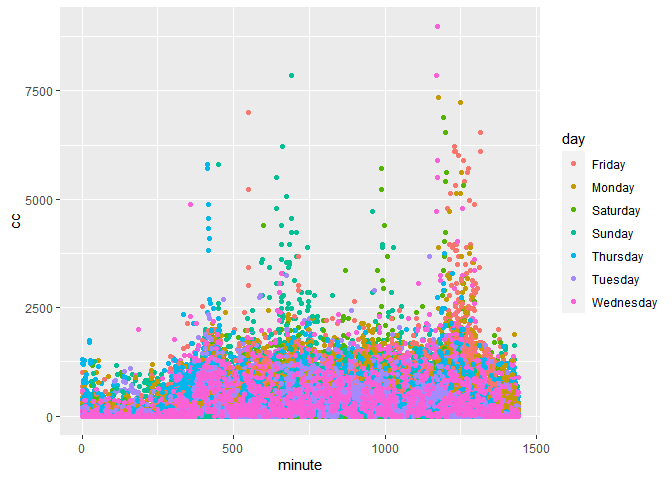
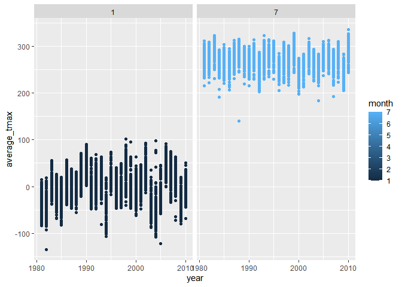
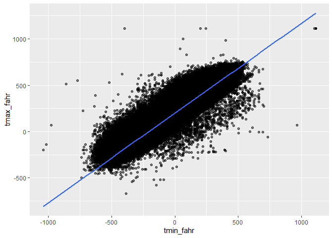
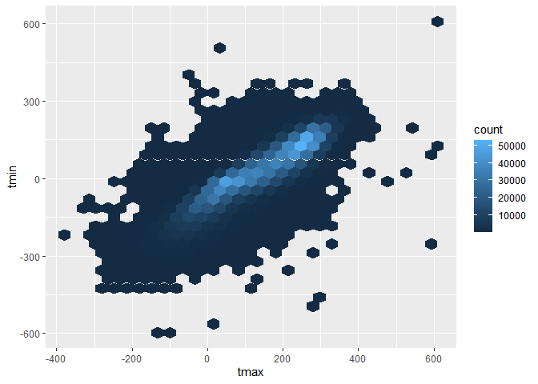
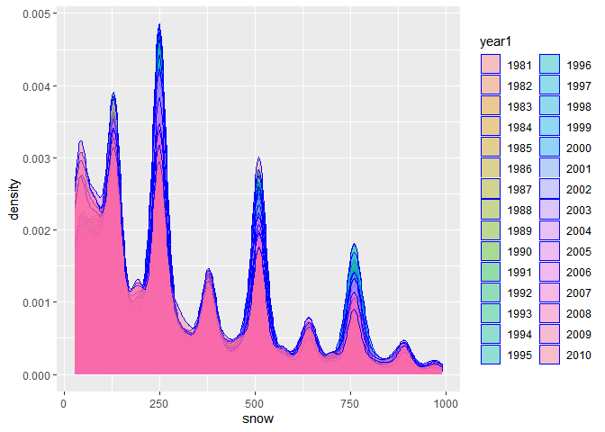

Simple document
================

\##Problem2 \#introduce the dataset

``` r
library("p8105.datasets")
acc=read_csv("C:/Users/10145/Desktop/p8105_hw2_zx2425(1)/p8105_hw3_zx2425/p8105_hw3_zx2425/accel_data.csv")
```

    ## Rows: 35 Columns: 1443
    ## ── Column specification ────────────────────────────────────────────────────────
    ## Delimiter: ","
    ## chr    (1): day
    ## dbl (1442): week, day_id, activity.1, activity.2, activity.3, activity.4, ac...
    ## 
    ## ℹ Use `spec()` to retrieve the full column specification for this data.
    ## ℹ Specify the column types or set `show_col_types = FALSE` to quiet this message.

``` r
acc = acc %>% 
  janitor::clean_names()
```

The demensions of the raw dataset is `1443` \* `35`. It contains the
each minute of activity by days and its costs orginized by wide format.

\#clean the dataset

``` r
acc = acc %>%   
  mutate(weedd = case_when(
    day == "Monday" | day=="Tuesday" | day=="Wednesday" | day == "Thursday"| day == "Friday" ~ "weekday",
    day == "Saturday"|day=="Sunday" ~ "weekend" ,
    TRUE     ~ "" ))
acc = acc %>% 
      mutate(
    sum=rowSums(.[4:1443])
  )
acc=acc %>% 
  pivot_longer(activity_1:activity_1440,names_to="act",values_to="cc") 
acc=acc %>% 
separate(act, into = c("activity_name", "minute")) %>%
  mutate(
    minute=as.numeric(minute)
  ) %>% 
select(-activity_name)
acc
```

    ## # A tibble: 50,400 × 7
    ##     week day_id day    weedd       sum minute    cc
    ##    <dbl>  <dbl> <chr>  <chr>     <dbl>  <dbl> <dbl>
    ##  1     1      1 Friday weekday 480543.      1  88.4
    ##  2     1      1 Friday weekday 480543.      2  82.2
    ##  3     1      1 Friday weekday 480543.      3  64.4
    ##  4     1      1 Friday weekday 480543.      4  70.0
    ##  5     1      1 Friday weekday 480543.      5  75.0
    ##  6     1      1 Friday weekday 480543.      6  66.3
    ##  7     1      1 Friday weekday 480543.      7  53.8
    ##  8     1      1 Friday weekday 480543.      8  47.8
    ##  9     1      1 Friday weekday 480543.      9  55.5
    ## 10     1      1 Friday weekday 480543.     10  43.0
    ## # … with 50,390 more rows

The demensions of the raw dataset is `7` \* `50400`. It has been
translated to long format dataframe which means the activity variables
are represented by the time that the action is issued and its costs.
Also, there is a weedd variable represent the type of one day (weekend
or not). Furthermore, we sum of one day’s activity that showed in the
sum variable.

``` r
acc_sum <- unique(data.frame('day' = acc$day_id, 
                      'counts'=acc$sum))
ggplot(acc_sum, aes(x = day, y = counts)) + 
  geom_point()  
```

<!-- --> This
part calculate the total counts for each day, and draw a plot to find if
there are any trends for each day’s activity. The results show that
there are not apparent trend. However, during the 10\~30 days, there are
more regular activities done than at the begining and in the end of
those days.

\#arrange the order and make a plot

``` r
acc_ar=acc %>% 
  arrange(day_id)
acc_ar
```

    ## # A tibble: 50,400 × 7
    ##     week day_id day    weedd       sum minute    cc
    ##    <dbl>  <dbl> <chr>  <chr>     <dbl>  <dbl> <dbl>
    ##  1     1      1 Friday weekday 480543.      1  88.4
    ##  2     1      1 Friday weekday 480543.      2  82.2
    ##  3     1      1 Friday weekday 480543.      3  64.4
    ##  4     1      1 Friday weekday 480543.      4  70.0
    ##  5     1      1 Friday weekday 480543.      5  75.0
    ##  6     1      1 Friday weekday 480543.      6  66.3
    ##  7     1      1 Friday weekday 480543.      7  53.8
    ##  8     1      1 Friday weekday 480543.      8  47.8
    ##  9     1      1 Friday weekday 480543.      9  55.5
    ## 10     1      1 Friday weekday 480543.     10  43.0
    ## # … with 50,390 more rows

``` r
ggplot(acc, aes(x = minute, y = cc , color=day)) + 
  geom_point()  
```

<!-- --> It we
focus on the distribution of daily points and ignore the difference
among weekdays, it shows that athletes are more active during at time of
a day and the ending of a day. If compared different days during the
week, we can see most of the outline of the figure is composed by green
and red points, which possibly means that people are more active during
weekend. We can conclude that for the patients, they keep an eye on
their daily sport. And individuals always do more excercise at the
morning, noon and evening of a day. They are more likely to get high
level of activity during weekend.

\##problem3 \#introduce data

``` r
library(p8105.datasets)
data("ny_noaa")
nynoaadat=ny_noaa
```

Firstly, the data frame contains 2595176 objects and 7 variables.
Variables include id, date, prcp, snow, snwd, tmax, tmin  
So the next step lets organize the data set and have a outlook.

``` r
nynoaadat = separate(nynoaadat,date, into= c("year","month",'day'),sep= "-")

nynoaadat=mutate(
  nynoaadat, year=as.numeric(year),month=as.numeric(month),day=as.numeric(day),tmax=as.numeric(tmax),tmin=as.numeric(tmin))
```

The resulting dataset is 2595176 \* 9. The new variables are ‘year’,
‘month’ and ‘day’ which is extract by the data variable. The day_id mark
a unique day. And the ‘prep’,‘snow’, ‘snwd’, are represent the weather
condition which have different measurement.

So next, Let’s unified the measurement standard of ‘prep’, ‘snow’,
‘snwd’ and see the frequency of the ‘snow’.

``` r
nynoaadat=nynoaadat %>% 
  mutate(
    snow=snow*10,
    snwd=snwd*10
  )
nyno_fre=as.data.frame(table(nynoaadat$snow))
```

First, we multiply 10 to each variable of ‘snow’ and ‘snwd’, this is
because we do not want to lose data precision compared with the solution
that is to divide by 10. At the same time, after viewing the frequency
table of snow we can see the value of 0 is significantly larger than
other values, This possibly because the possible of the snow of the city
is low. Besides, we are comparing the frequency of no snow with the
frequency of snow at a certain level at the city.

``` r
nynoaadat %>% 
  filter(month==1 | month== 7) %>% 
  drop_na(tmax) %>% 
  group_by(month,id,year) %>% 
  summarize(
      average_tmax=mean(tmax)
    ) %>% 
  ggplot(aes(x=year,y=average_tmax,color=month))+geom_point()+
  facet_grid(.~month)
```

    ## `summarise()` has grouped output by 'month', 'id'. You can override using the
    ## `.groups` argument.

<!-- -->
According to the plot, we can see the range of tmax in January is
\[-100,100\], and July is \[200,310\]. The range is pretty different
either. On January is about 200, and on July is about 110 which
represent the temperature difference in January is higher than in July.
Both of them has outliers for exaple there are two extremely cold day on
January which should pay more attention to the reason: wheather is the
wrong data or not.

``` r
nynoaadat %>% 
  mutate(
    tmax_fahr = tmax * (9 / 5) + 32,
    tmin_fahr = tmin * (9 / 5) + 32) %>% 
  ggplot(aes(x = tmin_fahr, y = tmax_fahr)) +
  geom_point(alpha = .5) + 
  geom_smooth(method = "lm", se = FALSE)
```

    ## `geom_smooth()` using formula 'y ~ x'

    ## Warning: Removed 1136276 rows containing non-finite values (stat_smooth).

    ## Warning: Removed 1136276 rows containing missing values (geom_point).

<!-- -->

``` r
ggplot(nynoaadat, aes(x = tmax, y = tmin)) + 
  geom_hex()
```

    ## Warning: Removed 1136276 rows containing non-finite values (stat_binhex).

<!-- -->

Finally let’s analysis the snow weather.

``` r
snow100_filter=nynoaadat %>% 
  mutate(
    year=as.numeric(year),
    year1=factor(year)
  )
snow100_filter=filter(snow100_filter, snow>0 & snow<1000, .keep_all=TRUE)


ggplot(snow100_filter, aes(x = snow, fill = year1)) + 
  geom_density(alpha = .4, adjust = .5, color = "blue")
```

<!-- -->
